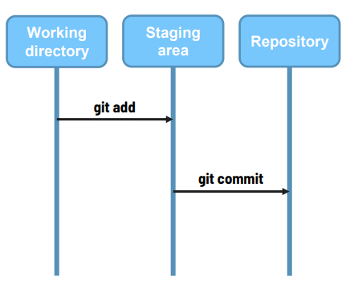
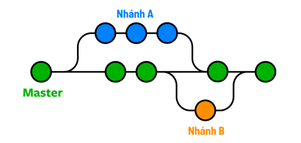

# 1. Document Git
## Các thuật ngữ trong git
  
Working directory(Thư mục làm việc):Khu vực chứa dự án mà chúng ta đang làm việc.  
Staging area (Khu vực sắp xếp):Khu vực chứa thông tin thay đổi của các file.  
Repository (Kho lưu trữ): Kho lưu trữ để lưu trữ dữ liệu, lịch sử các phiên bản.  
## Các câu lệnh phổ biến trong Git
Xem phiên bản GIT hiện tại đang được cài trên máy tính
```bash
git --version
```
Khởi tạo repository (kho lưu trữ) cho dự án.
Chạy câu lệnh trong thư mục gốc của dự án
```bash
git init
```
Để xem trạng thái của những file đã được thay đổi trong dự án
```bash
git status
```
Chuyển các file đã thay đổi từ vùng Working sang vùng Staging.
Staging area có tác dụng sắp xếp lại những file đã thêm vào.
```bash
git add ten_file || git add . 
```
Chuyển các file từ vùng Staging sang vùng Repository.
Repository có tác dụng tạo ra 1 phiên bản mới.
```bash
git commit -m "Nội dung… "
```
Xem lại lịch sử các commit.
Commit mới sẽ hiện bên trên, commit cũ sẽ hiện bên dưới.
```bash
git log
```
Dùng để xem chi tiết một commit.
```bash
git show commit_id
```
Xem sự thay đổi của một file sau khi chỉnh sửa.
Điều kiện là file đó vẫn đang ở khu vực Working.
```bash
git diff
```
Mở dashboard xem trực quan hơn.
```bash
gitk
```
Bỏ đi những thay đổi của file, để file đó trở về như lúc ban đầu
Áp dụng cho file đang ở vùng Working.
```bash
git checkout --ten_file
```
Chuyển file đó từ vùng Staging trở lại vùng Working
```bash
git reset HEAD ten_file || git reset ten_file
```
Chuyển từ trạng thái đã commit về trạng thái trước lúc chạy lệnh git commit.
Tức là từ Repository về lại Staging.
```bash
git reset --soft commit_id
```
Chuyển từ trạng thái đã commit về trạng thái trước lúc chạy lệnh git add
Tức là từ Repository về lại Working.
```bash
git reset --mixed commit_id
```
### Nhánh trong git
Các nhánh đại diện cho các phiên bản của một kho lưu trữ tách ra từ dự án chính.
Nhánh master là nhánh chính, để sau này deploy lên server.  

Xem danh sách các nhánh
```bash
git branch
```
Tạo một nhánh mới và chuyển sang nhánh đó.
```bash
git checkout -b ten_nhanh
```
Chuyển sang nhánh khác.
```bash
git checkout ten_nhanh
```
Để merge nhánh khác vào trong nhánh hiện tại.
```bash
git merge ten_nhanh
```
Để xóa nhánh.
```bash
git branch -D ten_nhanh
```
## Để đẩy code lên github khi chưa có git
```bash
git init
git add .
git commit -m "Nội dung commit"
git branch -M "tên nhánh mới"
git remote add origin url_github
git push -u origin "tên nhánh"

```
## kéo code từ github về máy
```bash
git pull origin tên_nhánh
```  


# 2. Gitflow Workflow

## Cấu trúc của Gitflow

### Nhánh chính (Main Branches):
- **main**: Nhánh này chứa mã nguồn ổn định và được phát hành. Mỗi lần bạn phát hành một phiên bản, mã trong nhánh `main` sẽ là mã mà người dùng cuối sẽ sử dụng.
- **develop**: Nhánh này chứa mã nguồn đang được phát triển. Tất cả các tính năng mới sẽ được tích hợp vào nhánh `develop` trước khi được phát hành.

### Nhánh phụ (Supporting Branches):
- **Feature Branches**:
  - Được tạo ra từ nhánh `develop` để phát triển một tính năng mới. Tên nhánh thường có dạng `feature/<tên-tính-năng>`.
  - Sau khi hoàn thành, nhánh này sẽ được hợp nhất (merge) vào nhánh `develop`.
  
- **Release Branches**:
  - Được tạo ra từ nhánh `develop` khi bạn sẵn sàng phát hành một phiên bản mới. Tên nhánh thường có dạng `release/<phiên-bản>`.
  - Nhánh này cho phép bạn sửa lỗi và thực hiện các thay đổi nhỏ trước khi hợp nhất vào nhánh `main` và `develop`.

- **Hotfix Branches**:
  - Được tạo ra từ nhánh `main` để sửa lỗi nghiêm trọng cần phải khắc phục ngay lập tức. Tên nhánh thường có dạng `hotfix/<tên-lỗi>`.
  - Sau khi sửa lỗi, nhánh này sẽ được hợp nhất vào cả hai nhánh `main` và `develop`.

## Quy trình Gitflow

### Phát triển tính năng mới:
#### Cách 1 Sử dụng câu lệnh gitflow
1. Để khởi tạo Gitflow trong kho lưu trữ Git của bạn, sử dụng lệnh sau:
    ```bash
    git flow init
    ```
2. Tạo phiên bản cho nhánh `main`
    ```bash
    git tag -a <version> -m "thông điệp version"
    ```
##### Làm việc với feature
1. Tạo nhánh feature mới:
    ```bash
    git flow feature start <feature-name>
    ```
2. Hoàn thành phát triển tính năng, bạn có thể kết thúc nó và hợp nhất vào nhánh `develop` bằng lệnh:
    ```bash
    git flow feature finish <tên_tính_năng>
    ```
3. Xuất bản nhánh feature lên repository từ xa:
    ```bash
    git flow feature publish <feature-name>
    ```
4. Lấy nhánh feature từ repository từ xa:
    ```bash
    git flow feature pull origin <feature-name>
    ```
##### Làm việc với Release
1. Sẵn sàng phát hành một phiên bản mới, một nhánh phát hành từ nhánh `develop`:
    ```bash
    git flow release start <phiên_bản>
    ```
2. Sau khi hoàn tất phát hành (bao gồm các sửa lỗi nếu cần), bạn có thể kết thúc nhánh phát hành và hợp nhất vào cả hai nhánh `main` và `develop`:
    ```bash
    git flow release finish <phiên_bản>
    ```
3. Xuất bản nhánh release lên repository từ xa:
    ```bash
    git flow release publish <release-version>
    ```
4. Lấy nhánh release từ repository từ xa:
    ```bash
    git flow release pull origin <release-name>
    ```
##### Làm việc với các nhánh Hotfix
1. Khi cần sửa một lỗi nghiêm trọng trên phiên bản đã phát hành, có thể tạo một nhánh sửa lỗi từ nhánh `main`:
    ```bash
    git flow hotfix start <tên_lỗi>
    ```
2. Sau khi bạn đã sửa lỗi, hãy kết thúc nhánh hotfix và hợp nhất vào cả nhánh `main` và `develop`:
    ```bash
    git flow hotfix finish <tên_lỗi>
    ```
3. Xuất bản nhánh hotfix lên repository từ xa:
    ```bash
    git flow hotfix publish <hotfix-name>
    ```
4. Lấy nhánh hotfix từ repository từ xa:
    ```bash
    git flow hotfix pull origin <hotfix-name>
    ```
#### Cách 2 Sử dụng câu lệnh thông thường
1. Tạo nhánh `feature` từ nhánh `develop`.
   ```bash
   git checkout -b feature/<tên-tính-năng> develop
   ```
2. Thực hiện các thay đổi cần thiết cho tính năng đó.
3. Khi hoàn thành, hợp nhất nhánh `feature` vào nhánh `develop`.
   ```bash
   git checkout develop
   git merge feature/<tên-tính-năng>
   ```
4. Khi bạn sẵn sàng phát hành một phiên bản, tạo nhánh `release` từ nhánh `develop`.
   ```bash
   git checkout -b release/<phiên-bản> develop
   ```
5. Thực hiện các sửa đổi cần thiết (như sửa lỗi, cập nhật tài liệu).
6. Hợp nhất nhánh `release` vào nhánh `main` và `develop`.
   ```bash
   git checkout main
   git merge release/<phiên-bản>
   git checkout develop
   git merge release/<phiên-bản>
   ```
7. Nếu cần phải sửa lỗi nghiêm trọng trong phiên bản đã phát hành, tạo nhánh `hotfix` từ nhánh `main`.
   ```bash
   git checkout -b hotfix/<tên-lỗi> main
   ```
8. Sửa lỗi và hợp nhất nhánh `hotfix` vào cả `main` và `develop`.
   ```bash
   git checkout main
   git merge hotfix/<tên-lỗi>
   git checkout develop
   git merge hotfix/<tên-lỗi>
   ```